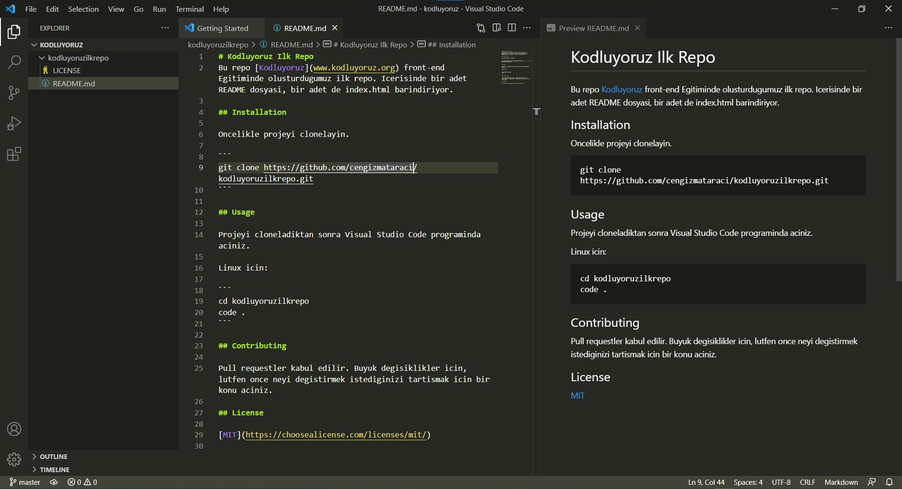

# Kodluyoruz Ilk Repo
Bu repo [Kodluyoruz](www.kodluyoruz.org) front-end Egitiminde olusturdugumuz ilk repo. Icerisinde bir adet README dosyasi, bir adet de index.html barindiriyor. 

## Installation 

Oncelikle projeyi clonelayin. 

```
git clone https://github.com/cengizmataraci/kodluyoruzilkrepo.git 
```

## Usage

Projeyi cloneladiktan sonra Visual Studio Code programinda aciniz. 

Linux icin: 

```
cd kodluyoruzilkrepo
code .
```

## Contributing 

Pull requestler kabul edilir. Buyuk degisiklikler icin, lutfen once neyi degistirmek istediginizi tartismak icin bir konu aciniz. 

## License

[MIT](https://choosealicense.com/licenses/mit/)



